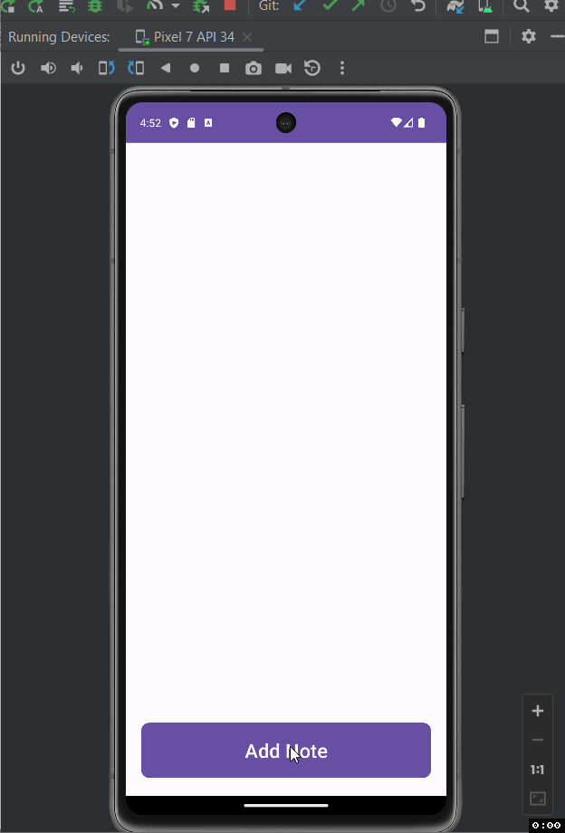

Notes Application

Description of the project ...

- The project is an application that is created to allow users to create and save notes with different contents. These notes should be saved until the next time the user opens the app and the app should retrieve the info
on the notes from its database.

## Functionality 

The following **required** functionality is completed:

* [ ] UI should be set up properly
* [ ] Proper loading and saving of notes in database
* [ ] Correct implementation recycler view with data binding, ListAdapter and DiffUtil
* [ ] Correct implementation of tapping title or delete button in RecyclerView
* [ ] Note Fragment functionality
* [ ] ...

The following **extensions** are implemented:

* No Extensions were used. Everything was from Kotlin

## Video Walkthrough

Here's a walkthrough of implemented user stories:

GIF created with [LiceCap](http://www.cockos.com/licecap/).

## Notes

Describe any challenges encountered while building the app.

- Understanding, using, and implementing the database.

## License

    Copyright [yyyy] [name of copyright owner]

    Licensed under the Apache License, Version 2.0 (the "License");
    you may not use this file except in compliance with the License.
    You may obtain a copy of the License at

        http://www.apache.org/licenses/LICENSE-2.0

    Unless required by applicable law or agreed to in writing, software
    distributed under the License is distributed on an "AS IS" BASIS,
    WITHOUT WARRANTIES OR CONDITIONS OF ANY KIND, either express or implied.
    See the License for the specific language governing permissions and
    limitations under the License.
